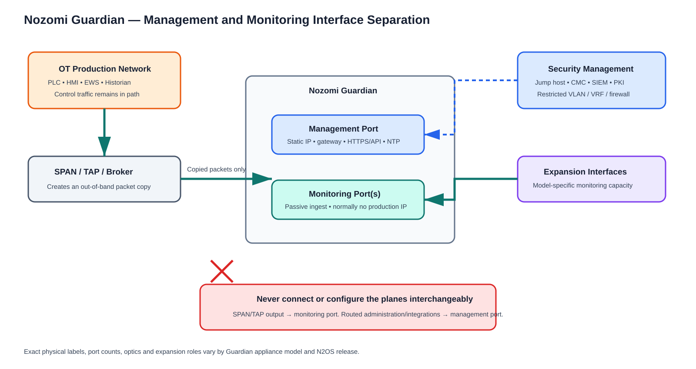

# Management, Monitoring and Expansion Interfaces

## 1. Management interface

The management interface is the sensor's addressed and normally routable control plane. It is used for the web console, administration, authentication, NTP/DNS/PKI, updates/licensing, backups, API/syslog integrations and Guardian-to-CMC/Vantage/collector coordination as applicable.

Design controls:

- Static IP on a dedicated OT security-management VLAN/VRF.
- Default gateway only here, unless the release-specific design explicitly requires otherwise.
- ACLs allow only named administration and integration sources/destinations.
- Access through a hardened jump host; RBAC, MFA/SSO and audit logging.
- Trusted certificate; remove reliance on bootstrap self-signed certificate for production.
- Never connect management to a SPAN destination or TAP monitor output.
- Bandwidth includes synchronization, integrations, updates and Remote Collector forwarding; measure it.

## 2. Monitoring interfaces

Monitoring ports ingest packet copies from TAPs, brokers or SPAN/mirror destinations. Their purpose is observation, not management or forwarding.

Expected design:

- No production IP address, default gateway, DHCP or DNS.
- Physically/logically isolated from the routable management plane.
- Receive-only behavior should be verified for the selected hardware/design.
- One interface may represent one capture domain; multiple interfaces can separate zones, sites or load.
- VLAN tags and capture origin should be preserved where needed.
- Interface status and packet/drop counters are operational health signals.
- A connected cable is not proof of visibility: validate packets, both directions, protocols and representative assets.

For a virtual sensor, monitoring vNICs attach to capture port groups. Hypervisor security and uplink design must allow copied frames without turning the VM into a bridge.

## 3. Expansion ports and slots

“Expansion” is hardware capacity, not a universal traffic role. Depending on the exact Guardian model and installed module, an expansion slot may add copper or fiber monitoring interfaces and different speeds. It does not automatically provide HA, management, inline blocking or additional licensed throughput.

Before use verify:

- Appliance model, module part number, supported optics/cables and N2OS release.
- Whether the ports are supported as monitoring interfaces.
- Aggregate appliance throughput and node/license limits.
- PCIe/module installation procedure, power-down requirement and warranty conditions.
- Port numbering after installation.
- Link speed, FEC, auto-negotiation and optical power requirements.
- Updated rack/cable/BOM and spare strategy.

Nozomi's current public specifications list different monitoring-port, management-port and expansion-slot combinations across NSG-M, NS20, NS1 and ruggedized models. Never copy a port count from another appliance.

## 4. Console, BMC and service ports

A physical console is for controlled local recovery/bootstrap. A baseboard-management controller or service interface, where present, is a privileged management path and must be isolated, access-controlled, patched and documented. USB ports should be governed by removable-media policy. Exact functions are model-specific.

## 5. Remote Collector interfaces

A Remote Collector has local capture interface(s) and management/upstream connectivity. It forwards captured traffic to Guardian and does not perform the same local analysis/UI role as Guardian. Official Nozomi documentation describes encrypted TLS transport with mutual X.509 authentication.

Design the WAN path for peak forwarded traffic, compression/strategy supported by the release, latency, outage behavior and certificate rotation. Restrict upstream destinations to assigned Guardian(s). Track collector identity/site so overlapping address space is not merged incorrectly.

## 6. Interface traffic-flow matrix

| Interface | Has IP? | Receives OT packet copies? | Initiates routed traffic? | Connected to |
|---|---:|---:|---:|---|
| Guardian management | Yes | No | Yes, as approved | OT security-management switch |
| Guardian monitoring | Normally no | Yes | No production traffic | TAP/broker/SPAN destination |
| Expansion monitoring | Normally no | Yes | No production traffic | Additional approved capture feeds |
| Local console | No routed IP | No | No | Controlled technician access |
| BMC/service, if present | Separate privileged IP | No | Limited | Isolated OOB management |
| Remote Collector upstream/mgmt | Yes | Locally captured traffic is forwarded | Yes to Guardian | Approved site/WAN management path |
| Remote Collector capture | Normally no | Yes | No production traffic | TAP/SPAN/broker |

## 7. Cable schedule minimum fields

Cable ID, sensor hostname, sensor port label, port role, peer device, peer interface, patch-panel ports, media/optic, speed, capture-point ID, source interfaces/VLANs, rack locations, installer, test date and photograph reference.

## 8. Common mistakes

- Addressing a monitoring port.
- Connecting SPAN output to the management port.
- Assuming all numbered RJ45/SFP ports are monitoring ports.
- Aggregating two 1-Gb full-duplex sources into one 1-Gb destination without load analysis.
- Forgetting standby/redundant paths.
- Losing VLAN tags and then misclassifying zones.
- Mirroring the same flow at multiple points without a duplicate strategy.
- Letting virtual sensors migrate away from capture uplinks.
- Using a Remote Collector without sizing WAN traffic.
- Enabling aggressive filters before establishing a baseline.
