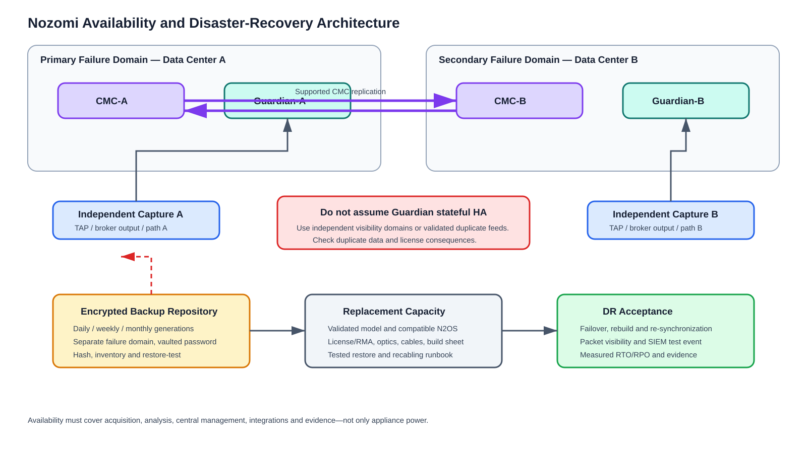

# High Availability, Sizing, Retention and Disaster Recovery

> Confirm model limits, licenses, backup compatibility and supported failover procedures against the installed N2OS release and an approved Nozomi design.

## Service objectives

Define separate targets for packet acquisition, local detection, central visibility, alert export and historical evidence. Example targets—requiring business approval—are: critical-feed monitoring RTO 15 minutes, Guardian rebuild RTO 4 hours, central-management RTO 1 hour, and RPO based on tested replication/backup behavior.

## Failure-mode design

| Failure | Monitoring effect | Architectural control |
|---|---|---|
| Guardian hardware/power | Site feeds blind | Dual power/UPS, spare/RMA, optional independent sensor |
| SPAN/cable/optic | Silent feed loss | Rate alarms, config backups, redundant feeds |
| TAP/broker | One or many feeds lost | Approved TAP behavior; broker HA/dual outputs |
| Management network | UI, sync/export unavailable | Redundant switches/paths and local-console procedure |
| CMC | Central view degraded | Supported two-CMC replication |
| WAN | Central/remote forwarding degraded | Local analysis, dual WAN, documented outage behavior |
| Remote Collector | Remote segment blind | Stale alarm, spare, certificate/rebuild procedure |
| Disk exhaustion | History/processing impaired | Category retention and capacity alarms |
| Certificate expiry | Sync/API/collector failure | PKI owner, expiry monitoring and rotation |
| Bad upgrade/config | Platform degradation | Tested rollout ring, backup, rollback and support |
| Site disaster | Sensor/history loss | Off-appliance backups and replacement build |

## CMC high availability

Official Nozomi documentation describes HA as replication between two CMCs. Place CMC-A and CMC-B in separate rack, power and compute failure domains—preferably separate data centers. Give them unique management identities, allow release-specific synchronization/sensor flows, keep versions compatible, monitor replication health and define how analysts reach the surviving console.

Do not invent a load balancer, virtual IP or automatic failover mechanism unless Nozomi approves it for the installed release.

### CMC failover acceptance

1. Record replication health and latest common event.
2. Confirm critical sensors appear healthy.
3. Isolate CMC-A using a supported method.
4. Confirm sensors/analysts continue through CMC-B.
5. Generate an approved test event and verify SIEM delivery.
6. Restore A, verify resynchronization and measure the gap.
7. Record actual RTO/RPO and defects.

## Guardian resilience

Do not describe two Guardians as a stateful HA pair without explicit product support. Critical coverage can use duplicate broker outputs to independent Guardians, separate redundant production paths to different Guardians, or a warm/cold spare with a tested restore and recabling plan.

Two Guardians seeing the same packets can duplicate assets, sessions, alerts and license consumption upstream. Validate deduplication with Nozomi. A shared TAP, packet broker, SPAN source, power feed, switch or CMC can defeat apparent redundancy.

## Sizing methodology

Measure at least seven representative days including startup, batch changes, maintenance and failover:

- Average, 95th-percentile and peak Mbps in both directions.
- Average/peak packets per second, average packet size and bursts.
- Active nodes, projected silent assets, sessions/network elements and VLANs.
- Protocols, broadcast/multicast and malformed traffic.
- Duplicate rate from overlapping capture points.
- Remote Collector forwarded traffic and WAN behavior.
- Alert/integration load and storage growth by category.
- Three-to-five-year growth and degraded-mode load.

Calculations:

~~~text
aggregate_peak_Mbps = sum(source_peak_Mbps × mirrored_directions × duplication_factor)
required_output_capacity = aggregate_peak_Mbps / approved_target_utilization
projected_nodes = current_nodes × (1 + annual_growth)^years
projected_PPS = measured_peak_PPS × growth_factor × redundancy_factor
raw_GiB_per_day = average_Mbps × 86400 / 8 / 1024
~~~

At a continuous 100 Mb/s, raw traffic is about 1,055 GiB/day. Guardian generally retains configured categories and selected traces—not automatically every raw packet forever. Use raw volume only to expose unrealistic PCAP expectations or size separate capture storage.

Approve the BOM only after exact technical specifications are checked for throughput, nodes/network elements, ports/media, collectors, VM resources, storage, integrations, environment and growth. Obtain written vendor/partner sizing validation.

## Retention architecture

Guardian retention can be limited by maximum age, item count and, for supported categories, disk space. Define policy from investigative value:

| Data | Example policy—not a default |
|---|---|
| Alerts/cases | 365 days plus central export |
| Asset/node history | 180–365 days |
| Sessions/links | 90–180 days |
| Time Machine snapshots | 30–90 days |
| Requested traces | 14–30 days or legal hold |
| Audit/config logs | 365+ days in SIEM/archive |
| Health/capacity | 90–365 days |
| Backups | Daily/weekly/monthly generations |

Implementation: measure pilot growth, approve investigation/legal lookback, set age/item/space limits, alarm on free space, export long-term evidence, test expiry and reassess after topology/content changes. Time Machine is investigative history, not a DR backup.

## Backup architecture

Nozomi documentation supports full/scheduled backup archives and restore. Scheduled backups may be daily, weekly or monthly and copied remotely through supported protocols. Traces are excluded by default; continuous traces are not included by the include-traces option. Documentation also notes that some vulnerability and schedule data are not contained in backups, so verify exact release behavior.

Recommended controls:

- Encrypted daily backups retained 14 days, weekly for 8 weeks, monthly for 12 months where policy allows.
- Copy off appliance and into a separate failure domain.
- Vault the encryption password; restrict download/restore roles.
- Hash and inventory archives.
- Back up before and after upgrades/major tuning.
- Export critical traces separately.
- Restore-test quarterly on isolated replacement infrastructure.

## Disaster recovery runbook

1. Declare incident and obtain OT change approval.
2. Preserve failed appliance/evidence if investigation is required.
3. Confirm replacement model, N2OS/backup compatibility and licensing.
4. Build replacement on isolated management.
5. Patch/harden, upload verified archive and use supported full restore.
6. Re-establish certificates, identity, CMC/Vantage, collectors and integrations.
7. Reconnect feeds from the cable schedule.
8. Validate assets, protocols, both directions, alerts, time and health.
9. Record actual RTO/RPO and any history/relearning gap.

Recovery patterns: fail CMC-A to replicated CMC-B; rebuild a lost Guardian while alternate coverage continues if designed; replace a collector and renew trust; rebuild compromised systems from trusted media and rotate all credentials/certificates.

## Acceptance criteria

- CMC failover is demonstrated.
- Every Guardian has a documented recovery tier.
- Peak PPS/Mbps/nodes/load plus growth fit vendor-approved sizing.
- Retention is mapped to investigation needs and tested.
- Backups are encrypted, off appliance and restore-tested.
- Monitoring-loss, replication, storage and certificate alarms reach owners.
- RTO/RPO are measured during exercises.
