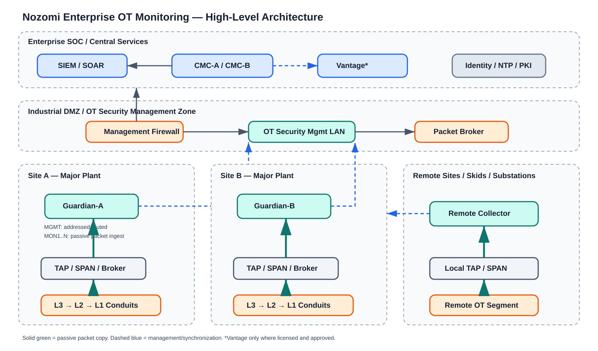

# Nozomi Networks OT Monitoring Design Package

> Reference architecture and implementation workbook. Validate appliance model, N2OS release, license, throughput, retention and port labels against the approved Nozomi bill of materials and current vendor documentation before implementation.

## Documents

1. [High-level design](01-hld.md)
2. [Low-level design](02-lld.md)
3. [SPAN and TAP implementation](03-span-tap-change-plan.md)
4. [Interface and connectivity design](04-interface-connectivity.md)
5. [Commissioning and acceptance](05-commissioning-runbook.md)
6. [Experienced-practitioner interview guide](06-interview-guide.md)
7. [High availability, sizing, retention and disaster recovery](07-ha-sizing-retention-dr.md)
8. [Asset discovery and inventory governance](08-asset-discovery-workflow.md)
9. [Detection engineering and tuning](09-detection-engineering-workflow.md)
10. [Investigation and threat-hunting playbooks](10-investigation-hunting-playbooks.md)

## Architecture diagrams

- [Enterprise HLD](diagrams/nozomi-enterprise-hld.svg)
- [Interface separation](diagrams/nozomi-interface-separation.svg)
- [HA and disaster recovery](diagrams/nozomi-ha-dr.svg)
- [SOC workflow](diagrams/nozomi-soc-workflow.svg)

## Design intent

Nozomi Guardian passively receives copies of OT traffic from network TAPs, packet brokers, or switch SPAN/mirror sessions. It analyzes the copies; it is not inserted into the control path. A separate management network carries administration, updates, integrations, synchronization, and alert forwarding. A CMC provides enterprise visibility across Guardians. Remote Collectors extend capture into small or isolated locations and forward encrypted traffic to a Guardian.

## Non-negotiable principles

- Preserve safety and availability: no active scanning or control-system change without asset-owner approval.
- Keep management and monitoring planes separate.
- Prefer TAPs or packet brokers for critical, high-load, redundant or evidentiary links.
- Treat SPAN as a capacity-limited copy, not guaranteed packet capture.
- Monitor choke points and control conversations, not every switch port.
- Avoid duplicate feeds; document VLANs and traffic direction.
- Size from measured PPS, throughput, bursts, nodes, elements, protocols, retention and growth.
- Use formal MOC for production switch, firewall, hypervisor, rack, power or cabling work.

## Product terminology

- **Guardian:** network sensor that analyzes mirrored/TAP traffic.
- **CMC:** central manager for multiple Guardians.
- **Remote Collector:** distributed capture sensor forwarding to Guardian.
- **Vantage:** cloud-delivered management/analytics where approved.
- **Arc:** supported endpoint sensor complementing network visibility.
- **Management interface:** addressed/routable administration and integration interface.
- **Monitoring interface:** passive packet-ingest interface; normally no production IP or gateway.
- **Expansion ports:** model-specific additional NIC/slot capacity.

## Authoritative references

- [Nozomi technical specifications](https://www.nozominetworks.com/platform/technical-specifications)
- [Guardian installation documentation](https://technicaldocs.nozominetworks.com/products/n2os/topics/installation/virtual/t_vm_monitor-interface_add_guardian.html)
- [Remote Collector overview](https://technicaldocs.nozominetworks.com/products/remote-collector/topics/intro/c_rc-1.html)
- [CMC high availability](https://technicaldocs.nozominetworks.com/products/n2os/topics/administration/settings/sync/c_n2os_admin_settings_sync_cmc_general_ha.html)
- [Guardian retention](https://technicaldocs.nozominetworks.com/products/n2os/topics/administration/settings/features/c_n2os_admin_settings_features_retention_guardian-1.html)
- [Backup and restore](https://technicaldocs.nozominetworks.com/products/n2os/topics/administration/system/backup-restore/c_n2os_admin_system_backup-restore-2.html)
- [Smart Polling](https://technicaldocs.nozominetworks.com/products/nozomi/topics/c_nozomi_platform_smart-polling.html)

This package is deliberately model-neutral. Exact connector numbers, traffic limits, optics, node counts, collector limits and features vary by hardware, license and release.
