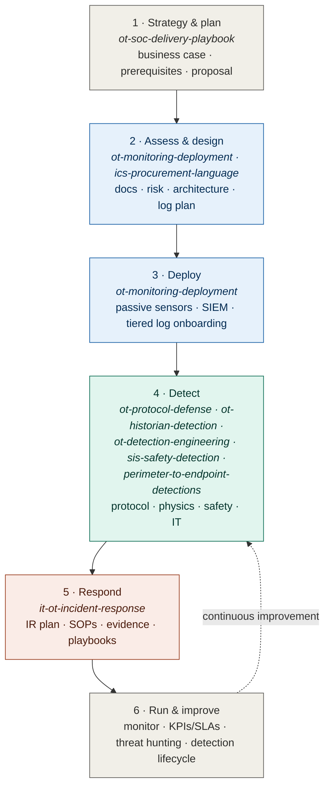

# OT Security Portfolio

**Building, running, and defending an OT/ICS Security Operations Centre — end to end.** This is the index to a body of work spanning strategy, deployment, detection engineering (protocol, physics, safety, and IT), incident response, and procurement.

---

## The journey, start to end

The repositories aren't standalone — each is a **deliverable in a phase** of an OT SOC program. This is the map from content to real delivery.

*Legend: gray = plan · blue = build · teal = detect · coral = respond.*

> If the diagram above doesn't render, see [`assets/journey-map.svg`](assets/journey-map.svg).

## The repositories

| # | Repository | Phase | One-line pitch |
|---|-----------|-------|----------------|
| 1 | **ot-soc-delivery-playbook** | Strategy | Where to start, the business case, prerequisites, and how to build & price an OT SOC proposal — the delivery method that ties it all together. |
| 2 | **ot-monitoring-deployment** | Assess / Design / Deploy | The documents to gather before deploying OT monitoring, and the tiered order to onboard log sources after. |
| 3 | **ics-procurement-language** | Assess | The DHS OT procurement-language reference, made browsable — 47 controls to put security into RFPs and contracts. |
| 4 | **ot-protocol-defense** | Detect | What 13 industrial protocols mean for a defender, 54 detections, and Nozomi (N2QL) assertion queries. |
| 5 | **ot-historian-detection** | Detect | Baseline-and-deviation detection on the process historian — the physics layer that catches Stuxnet/TRITON-class manipulation. |
| 6 | **ot-detection-engineering** | Detect | 87 Sigma rules across protocol, IT→OT cross-zone, and threat-actor detection. |
| 7 | **sis-safety-detection** | Detect | Safety-system (SIS) monitoring grounded in IEC 61511 — the TRITON/TRISIS-class coverage most SOCs lack. |
| 8 | **perimeter-to-endpoint-detections** | Detect | 62 enterprise detections across the external-facing kill chain (network, identity, endpoint, east-west, DNS, scanning, prohibited traffic). |
| 9 | **it-ot-incident-response** | Respond | An OT-adapted IR plan, investigation SOPs, and an evidence layer that maps *what you need to prove* to *where the artifact lives*. |

## How they compose into a service

| Tier | Includes |
|------|----------|
| **Essential** | Visibility + boundary/remote-access detection + IR readiness |
| **Advanced** | + full protocol & Sigma detection + physics layer |
| **Safety-critical** | + SIS monitoring + IT perimeter + threat hunting |

Full mapping: `ot-soc-delivery-playbook/06-portfolio-map.md`.

## Through-line
Everything here is **defensive, read-only, and safety-first** — mapped to MITRE ATT&CK for ICS and aligned to IEC 62443, NIST SP 800-82r3, and NIST CSF 2.0. The consistent idea: detection in OT has to see the *process*, not just the packets.

## Author
Mahesh Reddy — OT/ICS Security · GICSP, SANS ICS410, Nozomi Certified

## License
MIT — see [`LICENSE`](LICENSE).
