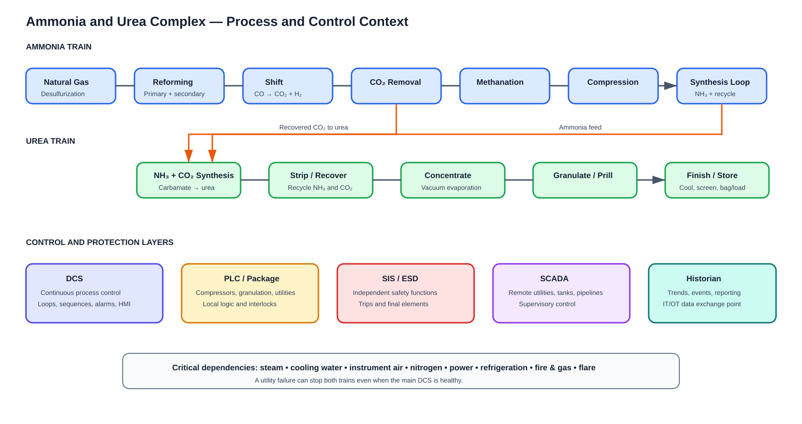

# Plant Process and Plant Language

## What the cybersecurity analyst must understand

You do not need to operate the plant. You must understand what each unit does, what can stop it, which systems control/protect it, and why a network event matters to safety, production, environment or product quality.

## Ammonia train

1. **Feed-gas handling/desulfurization:** natural gas is conditioned and sulfur is removed to protect catalysts.
2. **Primary reformer:** methane and steam produce hydrogen-rich synthesis gas. Furnace fuel, burner management, tube temperatures, steam/carbon ratio and draft are important.
3. **Secondary reformer:** process air supplies nitrogen and supports further reforming.
4. **Shift conversion:** carbon monoxide reacts with steam to produce more hydrogen and CO₂.
5. **CO₂ removal:** CO₂ is separated; it becomes feed to urea production.
6. **Methanation/purification:** residual carbon oxides are reduced to protect the ammonia catalyst.
7. **Synthesis-gas compression:** large compressors raise pressure; anti-surge and machinery-protection systems are critical.
8. **Ammonia synthesis loop:** nitrogen and hydrogen react over catalyst; unreacted gas is recycled.
9. **Refrigeration/separation:** ammonia is condensed, separated and sent to storage or urea.
10. **Storage/export:** refrigerated or pressurized storage, transfer pumps, loading and toxic-release controls.

Cyber-relevant dependencies: reformer burner management, compressor controls, instrument air, cooling water, steam, nitrogen, electrical power, refrigeration, flare, fire and gas, and analyzer systems.

## Urea train

1. Liquid ammonia and recovered CO₂ enter high-pressure synthesis.
2. Ammonium carbamate forms and dehydrates into urea and water.
3. Stripping/decomposition removes unreacted NH₃ and CO₂.
4. Recovery/condensation returns reactants to the synthesis loop.
5. Vacuum concentration raises urea concentration.
6. Granulation or prilling forms solid product.
7. Cooling, screening and recycle control particle size.
8. Coating, conveyors, storage, bagging and bulk loading finish the product.
9. Process-condensate treatment recovers material and controls discharge.

Cyber-relevant systems include high-pressure pumps, compressors, control valves, stripper/recovery loops, vacuum systems, granulator PLCs, fans, scrubbers, conveyors, weighers, bagging and warehouse interfaces.

## Documents and symbols

- **PFD:** Process Flow Diagram; major equipment and material/energy flows.
- **P&ID:** Piping and Instrumentation Diagram; equipment, piping, valves, instruments, loops and safeguards.
- **Cause-and-effect:** which initiating condition causes alarm, trip or shutdown action.
- **Control narrative:** intended sequence, permissives, interlocks and operator actions.
- **Loop diagram:** transmitter-controller-final-element wiring and signal path.
- **Logic diagram:** Boolean/sequential controller behavior.
- **Instrument index:** tag, type, service, range and system.
- **I/O list:** field signals assigned to controller channels.
- **Network drawing:** switches, VLANs, firewalls, interfaces and redundancy.
- **SRS:** Safety Requirements Specification for safety functions.
- **MOC:** Management of Change approval and evidence.

## Tag language

A tag typically combines measured variable and function. Site conventions differ:

- FT/FI/FIC: flow transmitter/indicator/indicating controller.
- PT/PI/PIC: pressure.
- TT/TI/TIC: temperature.
- LT/LI/LIC: level.
- XV: on/off valve.
- FV/PV/TV/LV: control valve associated with a variable.
- PSV: pressure safety valve.
- ESD: emergency shutdown.
- HH/LL: high-high/low-low condition.
- Permissive: condition required before action can start.
- Interlock: logic preventing or stopping unsafe operation.
- Trip: protective action moving equipment/process toward safe state.
- Bypass/inhibit/override: temporary suppression; tightly governed.
- Setpoint/process value/output: desired value, measured value and controller demand.
- Auto/manual/cascade: controller operating modes.
- Bad quality/stale/frozen: signal-quality concerns.

## Equipment language

Know reactor, reformer, converter, absorber, stripper, separator, exchanger, condenser, compressor, turbine, pump, vessel, drum, column, granulator, prill tower, scrubber, flare, relief valve, analyzer, MCC, VFD and switchgear.

For rotating machinery understand start/stop, permissive, trip, vibration, bearing temperature, speed, lube oil, seal system and anti-surge. A cyber alert involving a compressor PLC has potentially greater consequence than the same network behavior on a printer.

## Questions to ask operations

- What are the major shutdown causes?
- Which equipment has no online spare?
- Which systems are SIS versus ordinary DCS interlocks?
- Which modes are normal during startup, shutdown and maintenance?
- Who may change logic/setpoints and from which workstation?
- Which vendor connections are temporary?
- What does loss of this controller, utility or network cause?
- Which tags indicate real process impact?
- What evidence confirms safe recovery?
