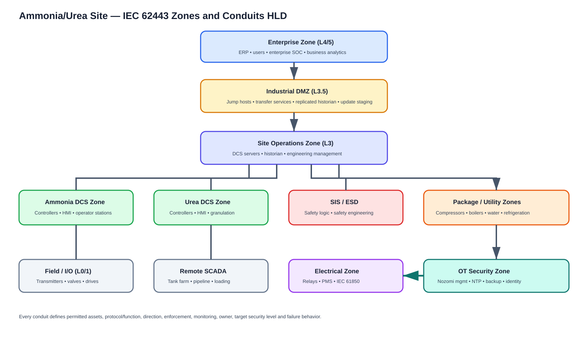
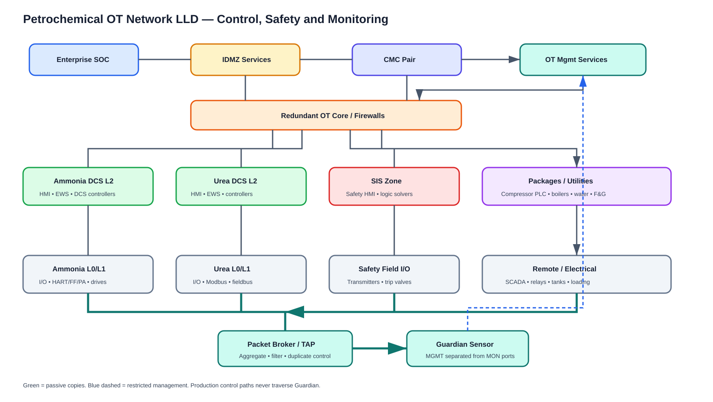

# IEC 62443 Zones, Conduits and Network Design

## HLD principles

A zone groups assets sharing cybersecurity requirements based on function, criticality and consequence—not merely a VLAN. A conduit is the governed communication path between zones. Purdue levels help describe hierarchy but are not a sufficient security design.

Recommended zones include enterprise, IDMZ, site operations, OT management, ammonia DCS, urea DCS, SIS/ESD, F&G, compressor/machinery, package units, utilities, electrical/PMS, tank farm/loading, remote access, historian/applications, wireless/IIoT and security monitoring.

## Conduit specification

Every conduit records:

- Source/destination zones and named assets.
- Business/process purpose.
- Initiator and direction.
- Protocol, service and industrial functions allowed.
- Authentication, encryption and certificates.
- Firewall, data diode, proxy or gateway enforcement.
- Nozomi/TAP/SPAN monitoring point.
- Logging, retention and alerting.
- Owner, target security level and approval.
- Availability/fail-safe behavior.
- Test, rollback and periodic review.

“Any/any” between OT zones is not a conduit design.

## Typical conduits

- Enterprise ↔ IDMZ: business/reporting and controlled administration.
- IDMZ ↔ historian/application: replicated data, brokered transfer.
- Operations ↔ ammonia/urea DCS: operator/application services.
- DCS ↔ package PLC: approved status, setpoints and commands.
- DCS ↔ SIS: minimal status/interlock data with strict direction.
- Engineering zone ↔ controllers: time-bound programming path.
- Vendor remote access ↔ jump host ↔ EWS: MFA, approval, recording.
- Electrical ↔ operations: power status/approved control.
- Remote sites ↔ SCADA: authenticated/controlled telemetry.
- Nozomi monitoring: one-way packet copies.
- Nozomi management: restricted HTTPS, sync, NTP, SIEM and backup.

## LLD

LLD deliverables:

- Hostnames, IPs, VLANs, VRFs, subnets and gateways.
- Physical/logical switch interfaces and redundancy.
- Firewall objects/rules with owner and expiry.
- DCS/PLC/SIS server/controller roles.
- Management and monitoring interface separation.
- TAP/SPAN/broker source/destination map.
- Bandwidth/PPS, duplicate and VLAN-tag analysis.
- NTP/DNS/PKI/identity/backup flows.
- Remote-access sequence and session recording.
- Serial/non-IP networks and blind spots.
- Cable, rack, power and optic schedule.
- Acceptance and rollback steps.

## Monitoring priorities

1. Enterprise–IDMZ and IDMZ–OT boundaries.
2. Level 3 site core.
3. DCS supervisory-to-controller boundaries.
4. DCS-to-package conduits.
5. Restricted SIS/F&G boundary.
6. Compressor/turbine controls.
7. Remote access.
8. Electrical/PMS.
9. Tank farm/loading and remote sites.

Monitoring is out of band. Guardian is not inserted into process traffic. Its management port is routed on the security-management network; monitoring ports ingest TAP/SPAN/broker copies without becoming production endpoints.

## Design review questions

- Can enterprise traffic reach a controller directly?
- Can a general DCS workstation reach SIS engineering?
- Are vendors restricted to named targets/windows?
- Are redundant paths both monitored?
- Does gateway translation hide original operations?
- Can a silent device be absent from passive inventory?
- What happens if the firewall, switch, DNS, NTP or management network fails?
- Are process availability and monitoring availability measured separately?
- Are security levels based on risk assessment rather than device type?
