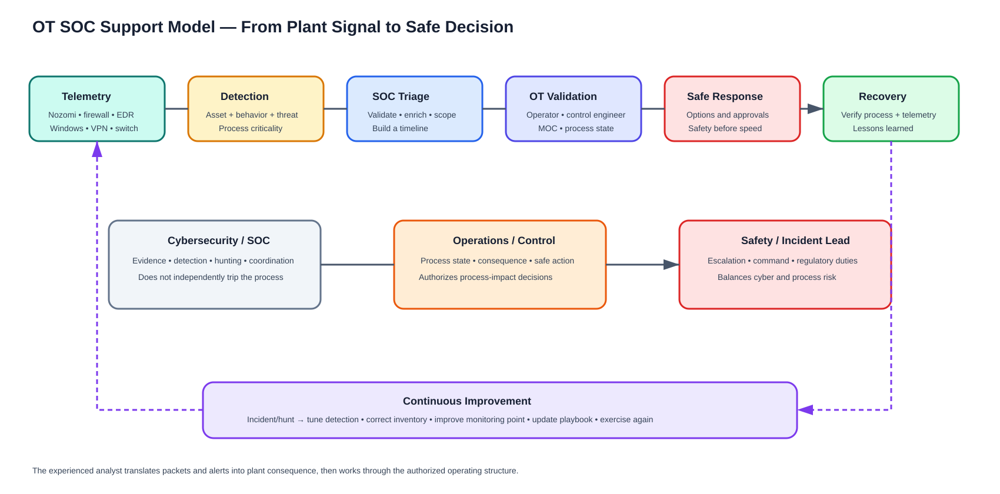

# OT SOC Role, Tools and Workflows

## Your role in the plant

The OT analyst translates technical evidence into process-relevant risk and coordinates through authorized operations. You do not independently trip, isolate, reboot, scan or reprogram plant equipment.

Daily responsibilities:

- Monitor Guardian/CMC, SIEM, EDR, firewall, VPN and infrastructure health.
- Triage alerts with asset, zone, process and maintenance context.
- Detect new assets, links, protocols and remote-access behavior.
- Validate capture and integration health.
- Escalate credible control/safety activity to the correct owner.
- Preserve evidence and maintain cases.
- Tune detections under governance.
- Reconcile Nozomi and engineering inventory.
- Support MOC, projects, incident response and exercises.

## Skills

### Plant/process

Read PFD/P&ID, tag names, cause-and-effect, control narratives, alarm/trip concepts and equipment dependencies. Understand startup, shutdown, normal, degraded and maintenance modes.

### Controls

Explain DCS, PLC, SIS, F&G, SCADA, historian, EWS, HMI, remote I/O, gateway, compressor control and electrical protection. Understand controller mode, logic download, forcing, bypass and setpoint changes.

### Networking

Ethernet, MAC/ARP, IP/subnet/routing, TCP/UDP, VLAN/trunk, STP, redundancy, NAT, ACL/firewall, multicast, QoS, VPN, SPAN/TAP, packet broker, DNS/NTP/PKI and Windows authentication.

### Security engineering

IEC 62443 zones/conduits/security levels; NIST CSF; risk assessment; asset criticality; threat modeling; secure remote access; vulnerability/patch/MOC; backup/DR; detection engineering and incident response.

### Analysis

Wireshark/PCAP, protocol baselines, Nozomi queries/pivots, SIEM searches, timeline building, hypothesis-led hunting, evidence provenance, false versus benign positive, and clear reporting.

## Tool stack

| Capability | Tools/examples | What to demonstrate |
|---|---|---|
| OT NDR | Nozomi Guardian/CMC/Vantage | Assets, alerts, sessions, protocol operations, Time Machine, health |
| Packet analysis | Wireshark, tshark | Filters, conversations, retransmission, VLANs, function behavior |
| SIEM | Microsoft Sentinel, Splunk or platform used | Normalize, correlate, query, case and metrics |
| Endpoint | Defender/CrowdStrike/etc. where approved | EWS/server process, identity and file evidence |
| Network | Firewall manager, switch CLI/read-only NMS | Rule/route/SPAN/counter validation |
| Inventory | CMDB/CMMS/engineering records | Identity, owner, criticality and reconciliation |
| Cases | SOAR/ticket platform | Evidence, decisions, SLA and closure |
| Diagrams | Visio/draw.io/SVG | HLD, LLD, zones/conduits and data flows |
| Documentation | Git, Markdown, controlled document system | Peer review, versioning and as-built evidence |

## Alert investigation

1. Confirm sensor/feed/time health.
2. Validate asset identity and capture origin.
3. Read the exact observable and protocol function.
4. Identify process, owner, zone and criticality.
5. Correlate MOC/maintenance/operator logs.
6. Pivot through sessions, links, alerts and timeline.
7. Add VPN, identity, EDR, firewall, historian and switch evidence.
8. Scope other assets/sites and earliest activity.
9. Provide safe response options to operations/incident command.
10. Verify recovery and improve detection/inventory/coverage.

## Priority scenarios

New/unknown asset; PLC/DCS logic or mode change; SIS bypass/configuration; remote vendor anomaly; scanning/lateral movement; malware/IOC; new internet destination; time-source change; historian transfer anomaly; controller/link loss; Nozomi feed/collector outage.

## Plant communication

Use language such as: “Guardian observed an S7 engineering operation from EWS-X to controller Y outside change window Z; the controller supports ammonia compressor permissive logic. We have not confirmed process impact. Please validate operator/engineering activity and current compressor state before response.”

Avoid: “Nozomi says it is an attack, so isolate the PLC.”

## Shift handover

Record open cases, process state, active MOCs, vendor sessions, disabled/tuned alerts, blind feeds, degraded sensors, evidence preserved, next action, owner and escalation deadline.

## Evidence

Record product/version, query, timezone, clock offset, sensor/interface, packet-loss/retention limits and export hashes. Separate Nozomi metadata/selected traces from full packet capture.
