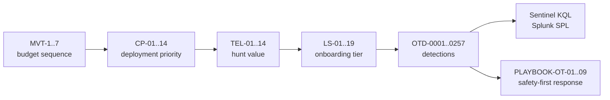

# OT Detect and Respond

**A consolidated, machine-validated OT/ICS security program spanning governance, telemetry,
detection engineering, protocol analytics, investigation, safety-first response, assurance,
deployment, procurement, managed services, and practitioner learning.**

This repository brings together the useful content from 18 previously separate repositories.
The consolidation evaluated 1,200 source files, retained 956 canonical content files, replaced
210 byte-for-byte copies with navigation pointers, and documented every decision in
[`docs/consolidation-manifest.csv`](docs/consolidation-manifest.csv). Repository-level metadata
was normalized to one license and one `.gitignore`.

The operational core contains **257 detections** consolidated from ten source libraries. Each
detection is connected to telemetry, Sentinel KQL, Splunk SPL, ATT&CK for ICS context, and—where
available—a safety-first response playbook. The surrounding capability layers explain how to
design, deploy, assure, procure, operate, and learn the program.

This is not a folder of documents. It is a system with five ID namespaces, generated
crosswalks, and a validator that fails the build if any reference breaks. You can start at a
threat and walk down to the SPAN port that catches it, or start at a budget line and walk up
to the ATT&CK techniques it buys.

---

## The chain



## Capability map

| Need | Start here | Outcome |
|---|---|---|
| Establish ownership and lifecycle | [`00-program/`](00-program/) | Governed detection backlog, RACI and promotion process |
| Decide what telemetry to collect | [`01-telemetry/`](01-telemetry/) | Prioritized log-source and monitoring plan |
| Build and tune detections | [`02-detection/`](02-detection/) | Catalogued OT, IT/DMZ, historian, SIS and SCADA analytics |
| Understand protocol attack surface | [`03-protocols/`](03-protocols/) | Protocol-specific visibility and detection requirements |
| Investigate and respond safely | [`04-response/`](04-response/) | Evidence-led, operations-coordinated incident handling |
| Trace coverage and relationships | [`05-crosswalk/`](05-crosswalk/) | Detection-to-telemetry-to-playbook traceability |
| Test detection effectiveness | [`06-assurance/`](06-assurance/) | Repeatable detection validation and gap reporting |
| Deploy and run an OT SOC service | [`07-operations/`](07-operations/) | Monitoring rollout, SIEM onboarding and service delivery |
| Procure and govern capabilities | [`08-governance/`](08-governance/) | Contractable controls and managed-service requirements |
| Build practitioner capability | [`09-learning/`](09-learning/) | Structured OT-security and AI-agent learning paths |

For the reasoning behind the structure, see
[`docs/CONSOLIDATION-GUIDE.md`](docs/CONSOLIDATION-GUIDE.md). For source-by-source provenance,
see [`docs/SOURCE-REPOSITORIES.md`](docs/SOURCE-REPOSITORIES.md).

## Numbers

| | |
|---|---|
| **Detections (canonical)** | **257** — `OTD-0001` … `OTD-0257` |
| **Duplicates merged** | 19, each with documented rationale (`merge-log.csv`) |
| **Sentinel KQL queries** | 257 — 90 compiled from Sigma, 161 scaffolds, 6 hand-authored |
| **Splunk SPL queries** | 257 — same provenance, tracked per detection |
| **Sigma rules** | 93 across 5 libraries |
| **ATT&CK for ICS techniques** | 49 distinct |
| **Response playbooks** | 9, covering 193 detections (75%) |
| **OT log sources scored & tiered** | 19 |
| **Protocol references** | 14 |
| **Cross-layer references validated** | 292 |

**119 of 257 detections are reachable with Tier 1 telemetry alone** — the number to put in
front of a customer asking what phase one actually delivers.

## Source libraries consolidated

| Library | Detections | What it contributes |
|---------|-----------:|---------------------|
| Perimeter-to-Endpoint | 61 | IT-side perimeter, identity, endpoint, east-west |
| OT Protocol Defense (NDR) | 48 | Protocol attack surface across 13 protocols |
| SIS Safety Detection | 31 | Functional-safety detections (boundary, bypass, voting, trip) |
| OT Threat Content | 28 | Threat-informed use cases with actor/sector context |
| Sigma: IT/DMZ/OT Cross-Zone | 23 | Purdue zone-crossing rules |
| Sigma: Threat Actor | 20 | Actor-derived rules |
| Sigma: CTI Advisory | 20 | Advisory-derived rules (ME/GCC focus) |
| Sigma: OT/ICS SOC | 14 | Protocol-level Sigma |
| Sigma: Core Protocol | 6 | Core protocol rules |
| OT Historian Detection | 6 | Process-data behavioural detections (hand-authored KQL/SPL) |

## Layout

```
00-program/      Lifecycle, RACI, templates - how content moves Proposed -> Production
01-telemetry/    What to collect, in what order (TEL / CP / MVT / LS)
02-detection/    catalog/ · sigma/ · historian/ · nozomi/ · queries/ · domains/
03-protocols/    14 protocol references (Modbus, DNP3, IEC-104, 61850, S7, OPC UA, CIP...)
04-response/     playbooks/ · sop/ · evidence/ · templates/
05-crosswalk/    GENERATED joins - do not hand-edit
06-assurance/    Detection testing, validation methodology and assurance evidence
07-operations/   Monitoring deployment, SIEM onboarding and SOC delivery
08-governance/   Procurement language and managed-security-service capability
09-learning/     OT-security study guide and applied AI-agent engineering
docs/            Architecture, telemetry strategy, safety doctrine, taxonomies
source-libraries/  Original catalogs preserved for provenance
tools/           build_catalog.py · generate_queries.py · build_crosswalk.py · validate.py
```

## Quick start

```bash
python3 tools/build_catalog.py      # merge source libraries -> master catalog
python3 tools/generate_queries.py   # compile every detection -> KQL + SPL
python3 tools/build_crosswalk.py    # regenerate cross-layer joins
python3 tools/validate.py           # verify everything resolves (exit 1 on failure)
```

CI runs all four and fails if the generated layer is stale.

## Query generation

Every detection has both a Sentinel and a Splunk query, with provenance tracked in
`02-detection/catalog/query-index.csv`:

- **`compiled-from-sigma` (90)** — a real compilation from the Sigma rule: selections,
  filters with correct negation, list membership, CIDR, contains/startswith modifiers, all
  mapped through an OT field-mapping table to the target schema.
- **`authored` (6)** — hand-written by the original author (historian detections); these
  are referenced, never overwritten.
- **`scaffold` (161)** — the detection is catalogued as a *specification*. The query names
  the right table/index and carries the intent, but **must be completed and validated
  against real telemetry before deployment**. Every scaffold says so in its header.

That distinction is deliberate and enforced. A scaffold presented as a production query is
how detection programs acquire silent false negatives.

## Placeholders are intentional

Queries contain `<ANGLE BRACKET>` placeholders and inline allowlists with example addresses.
These are the environment-specific values — zone CIDRs, authorized masters, tag prefixes,
thresholds — that **must be baselined locally**. A query that still contains placeholders
will execute but will not be correct.

## Safety

Every playbook carries a **Severity guide** and a **Safety check**, and every one is
validated for those sections by `tools/validate.py`. The standing doctrine:

> Priority order is **Safety → Availability → Integrity → Confidentiality**. Do not isolate,
> block, reset, or power-cycle any asset participating in a running process without
> confirming operational impact with the OT/process engineer.

The Safety check exists because **most hits on most OT playbooks are legitimate work with
missing paperwork** — and an analyst who skips it is one step from a disruptive response to
a non-event. Onboarding tier governs collection order; it never governs response priority.
See `docs/safety-doctrine.md`.

## Key documents

| Document | Covers |
|----------|--------|
| `docs/architecture.md` | Relational model, ID namespaces, what validation enforces |
| `docs/consolidation-report.md` | What merged, what stayed separate, and why |
| `docs/query-generation.md` | Field mappings, compilation rules, scaffold semantics |
| `docs/telemetry-strategy.md` | Three telemetry views and how to use them with a customer |
| `docs/safety-doctrine.md` | The universal safety line vs safety-centric handling |
| `docs/functional-safety-primer.md` | SIS independence, SIF, bypass discipline |
| `docs/baseline-methodology.md` | How baselines are built and re-based |

## Accuracy notes

- **Nozomi `type_id` strings vary by N2OS version** — reconcile against your Guardian
  version's *Alerts and Incidents Reference Guide* before relying on them in parsing.
- **Sigma rules** assume Zeek/ICSNPP-style field names; the compiler maps them to Sentinel
  and Splunk schemas declared in `tools/generate_queries.py`. Adjust `SOURCE_MAP` and
  `FIELD_MAP` to your environment.
- **161 scaffold queries are specifications, not deployable detections.** Treated as
  deployable, they will silently fail to fire.
- **Vendor TA** = Splunk Technology Add-on. Equivalents: Sentinel connectors, Elastic
  integrations, QRadar DSMs.

## License

MIT — see `LICENSE`. Original content authored by Mahesh Reddy.

---

*OT/ICS detection engineering — original content authored by Mahesh Reddy.*

