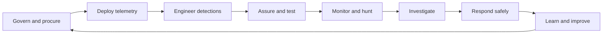

# Consolidation guide

## Purpose

This repository is the canonical home for the owner's OT detection-and-response material. It
combines governance, engineering, operations and learning content that previously lived in 18
separate repositories. Consolidation is content-aware: related material is placed beside the
capability it supports, while byte-for-byte duplicates point to one canonical copy.

## Design principles

1. **Safety before containment.** Response guidance assumes that an apparently simple block,
   reboot or isolation action can affect a physical process. Analysts coordinate disruptive
   actions with the responsible operator or process engineer.
2. **Telemetry before detection.** Every detection depends on a known data source, parser and
   collection path. Detection coverage that cannot be observed is treated as a gap.
3. **Detection as a lifecycle.** Content moves through proposal, development, validation,
   production, tuning and retirement with ownership and evidence at every stage.
4. **One canonical artifact.** Identical source files are not stored repeatedly. A lightweight
   pointer remains at the old logical location so navigation and provenance are preserved.
5. **Specifications are not production detections.** Scaffold queries require local schema,
   allow-list, threshold and baseline work before deployment.
6. **Traceability matters.** Crosswalks join telemetry, log sources, detections, ATT&CK context,
   queries and playbooks so decisions can be explained to engineers, SOC teams and management.

## End-to-end operating model



### Govern and procure

Use `00-program/` for lifecycle ownership and `08-governance/` for procurement clauses,
managed-service expectations and verification language. Define the systems in scope, risk
priorities, safety constraints, roles, evidence requirements and acceptance criteria.

### Deploy telemetry

Use `01-telemetry/` to prioritize collection and `07-operations/` to plan monitoring deployment
and SIEM onboarding. Validate network sensor placement, time synchronization, parser health,
asset context and data retention before enabling analytics.

### Engineer detections

Use `02-detection/catalog/` as the canonical inventory. The `extensions/` area adds specialist
SCADA, SIS, historian, perimeter, protocol-NDR and threat-content material. Use `03-protocols/`
to understand normal operations, dangerous functions and required fields for each protocol.

### Assure and test

Use `06-assurance/` to define test cases, expected evidence, pass/fail criteria and remediation.
Run active simulations only in a lab or explicitly authorized environment; do not exercise
unsafe control operations against a live process.

### Investigate and respond

Use `04-response/` for triage, evidence collection, scoping and playbooks. Validate whether an
event is an attack, an operational fault or authorized engineering work. Coordinate containment
with operations and preserve evidence before making disruptive changes.

### Learn and improve

Use metrics, incident lessons, false-positive analysis and assurance results to update the
backlog. `09-learning/` provides a structured path for practitioners who need the OT, protocol,
hunting, response and automation foundations behind the program.

## Deduplication method

Every source file was hashed with SHA-256. The first useful occurrence became canonical. Later
files with the same hash were replaced by a small format-valid pointer that names or links to
the canonical artifact. This preserves old folder relationships without maintaining multiple
copies that can drift. One root MIT license and one `.gitignore` replace repeated repository
metadata.

The machine-readable audit trail is `docs/consolidation-manifest.csv`:

- `included`: canonical content retained in the target;
- `exact-duplicate-pointer`: identical source content replaced with a pointer;
- `repository-metadata-skipped`: repeated license or Git metadata normalized at the root;
- `logical_path`: where the source concept appears in the consolidated layout;
- `canonical_path`: authoritative content location;
- `sha256`: source-content hash used for the decision.

## Verification

Run the repository validator from the root:

```bash
python tools/validate.py
```

The validator checks CSV structure, identifier universes, cross-layer references, detection
artifacts, query indexes, playbook sections and internal documentation links. The repository
also includes generation tools for rebuilding the catalog, queries and crosswalks.

Warnings about scaffold queries and detections without linked playbooks are delivery backlog
items, not reasons to treat those artifacts as production-ready.
